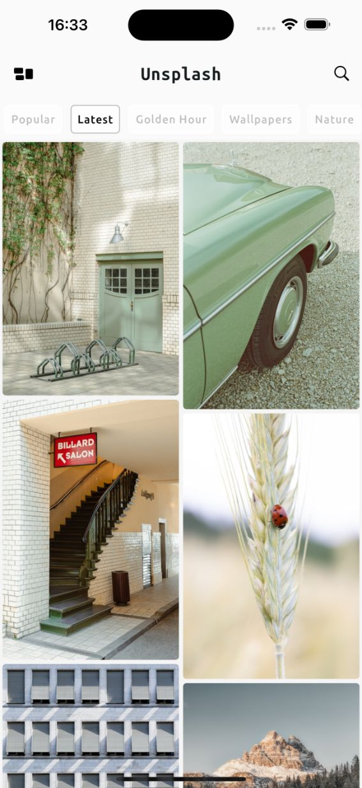
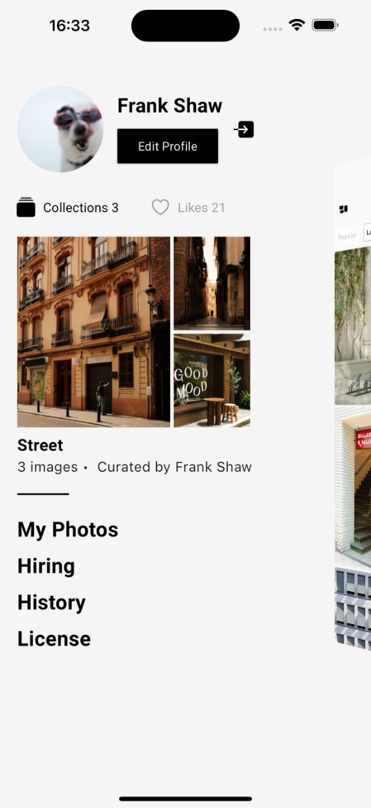
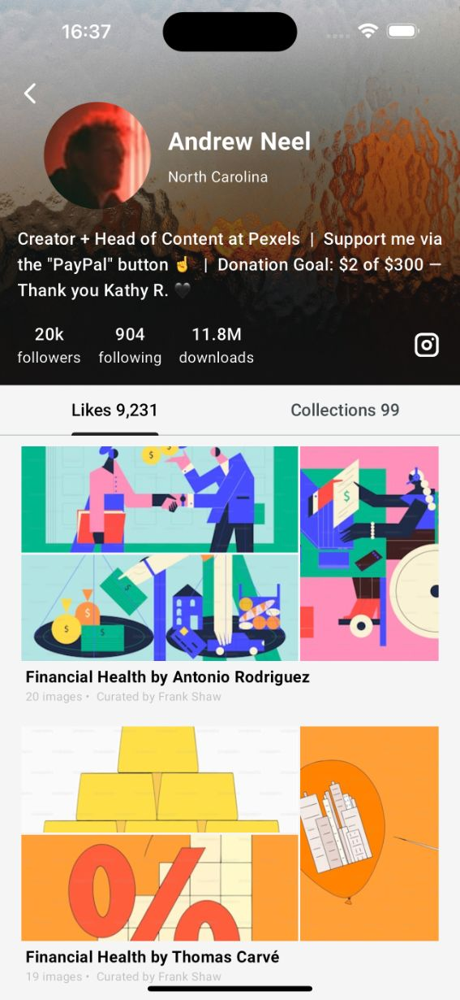
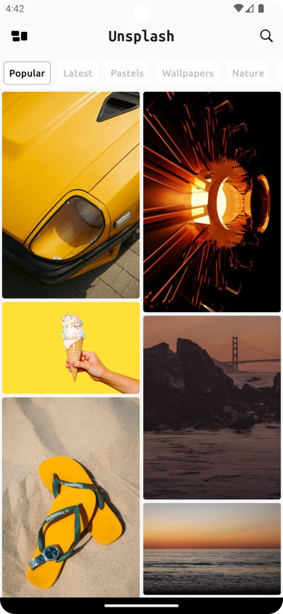
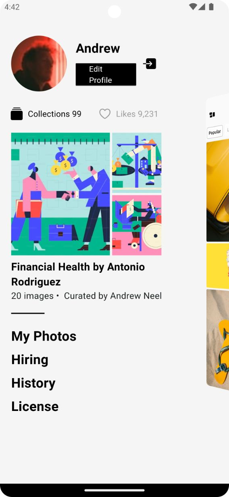
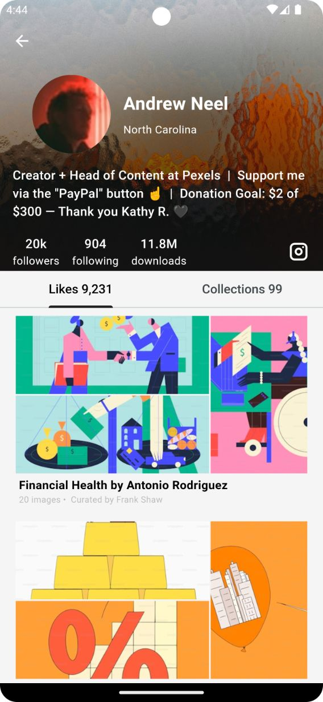

# SnapGallery

The SnapGallery App is a Flutter application that showcases a collection of beautiful images from Unsplash. The app is built with a clean architecture and incorporates modern state management and dependency injection techniques.

Supports: Android 📱, iOS📱

## Tech Stack ✨

- **Clean Architecture**
  - Presentation Layer: Contains UI and state management (Bloc).
  - Domain Layer: Contains business logic (Use cases).
  - Data Layer: Handles data retrieval from the Unsplash API and caching.
- **Modularization** - [melos](https://pub.dev/packages/melos)
- **State Management** - [Bloc](https://pub.dev/packages/flutter_bloc)
- **Dependency Injection** - [get_it](https://pub.dev/packages/get_it), [injectable](https://pub.dev/packages/injectable)
- **Networking** - [Dio](https://pub.dev/packages/dio)
- **Navigation** - [go_router](https://pub.dev/packages/go_router)
- **Linting** - [flutter_lints](https://pub.dev/packages/flutter_lints)
- **Load configuration** - [flutter_dotenv](https://pub.dev/packages/flutter_dotenv#flutter_dotenv)

## Screenshots
<div style="overflow-x: auto;">
<table>
    <tr>
        <td align="center">
			<h3>iOS</h3>
		</td>
        <td align="center">
			
    	</td>
    	<td align="center">
			
    	</td>
		<td align="center">
			
    	</td>
        <td align="center">
			
    	</td>
  	</tr>
	<tr>
		<td align="center">
			<h3>Android</h3>
		</td>
		<td align="center">
			
		</td>
        <td align="center">
			
		</td>
        <td align="center">
			
		</td>
  	</tr>
</table>
</div>

## Setup Requirements

Obtain an API key from [unsplash](https://unsplash.com/developers
) and add it to your .env file:
   ```
   ACCESS_KEY=
   SECRET_KEY=
   // optional for applications that are only using the 'Public' permissions
   REDIRECT_URI=
   ```
### Todo
- Unit Tests

### Contribute
If you want to contribute to this, you're always welcome!

### License
This project is licensed under the MIT License - see the LICENSE file for details.

### Acknowledgements
- [Unsplash](https://unsplash.com/) for providing the API.
- [Flutter](https://flutter.dev/) for an amazing framework